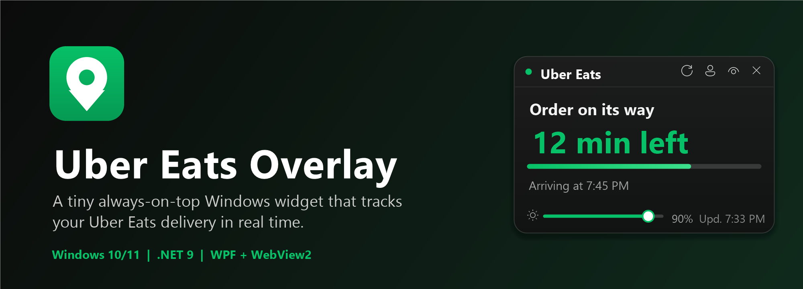
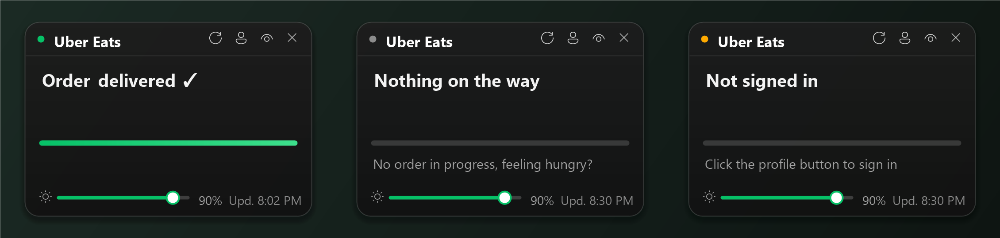
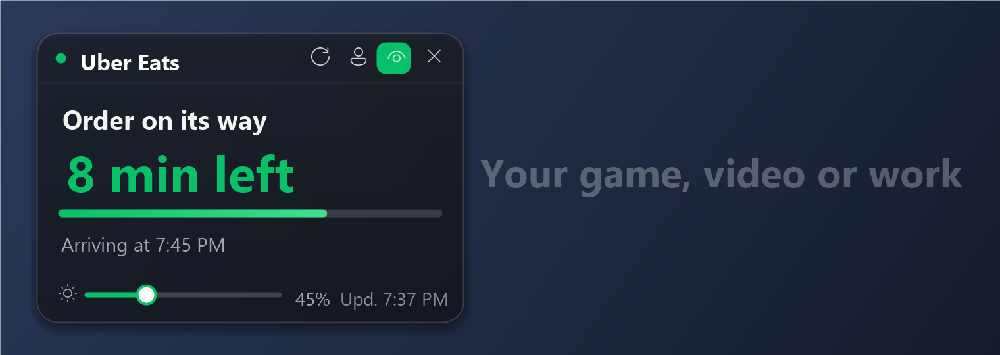

<p align="center"></p>

# Uber Eats Overlay

A small always-on-top, transparent, draggable Windows overlay that tracks your Uber Eats delivery and refreshes automatically.

Built with WPF + WebView2 on .NET 9. About 60 MB of RAM at idle.

## Features

- Draggable translucent card, position remembered between launches
- Transparency slider: only the background fades, the text stays sharp
- Click-through mode (`Ctrl+Alt+T`) and show / hide (`Ctrl+Alt+U`)
- Only visible while an order is in progress
- Time remaining and ETA, progress bar, Windows notifications on status changes
- French, English and Spanish (follows Windows by default, changeable from the tray menu)
- 24-hour or 12-hour clock (automatic from Windows, or your choice)
- Optional start with Windows
- Switch Uber Eats account from the profile button when signed in

## Preview

Illustrations with sample data.




## Installation

Download `UberOverlay-Setup.exe` from the [Releases](../../releases) page. It is a standalone installer: no admin rights and no .NET runtime required.

On first launch, click the profile button and sign in to Uber Eats.

> Windows SmartScreen may warn about an unknown publisher because the executable is unsigned. Click **More info**, then **Run anyway**.

## How it works

Uber Eats has no public API. Every 30 to 60 seconds the app briefly opens a WebView2 browser with your session, reads the order tracking page, then closes the browser to save RAM. Your password is never read or stored by the app; the session stays in `%AppData%\UberOverlay`.

> ⚠️ Unofficial project, not affiliated with Uber. It depends on the structure of the Uber Eats page and may break if Uber changes it.

To debug the page reading, launch the app with the environment variable `UBER_DEBUG=1`; a log is written to `%AppData%\UberOverlay\debug.log`. That log contains the text of your orders page, so do not share it as is.

## Build

Requires the .NET 9 SDK.

```powershell
dotnet run --project UberOverlay.Net -c Release     # run
powershell -File installer\build.ps1                 # build installer\out\UberOverlay-Setup.exe
```
